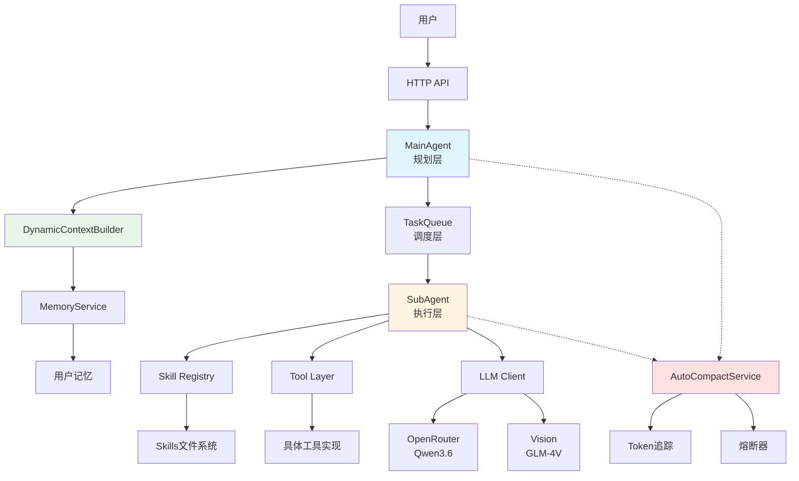
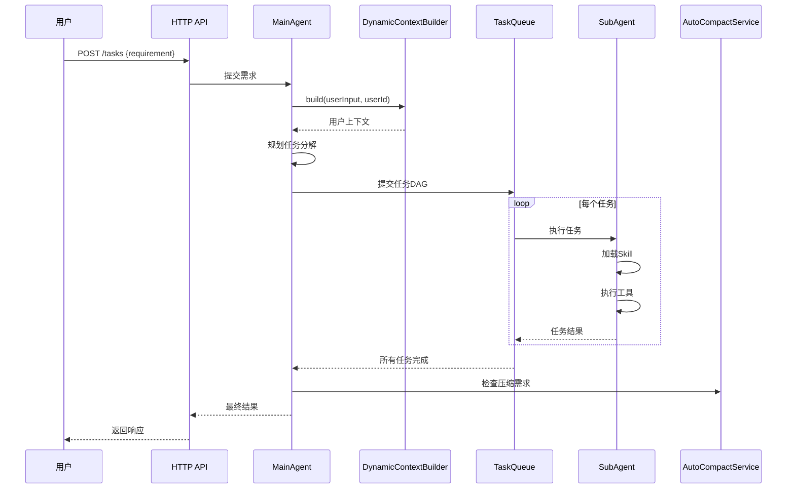
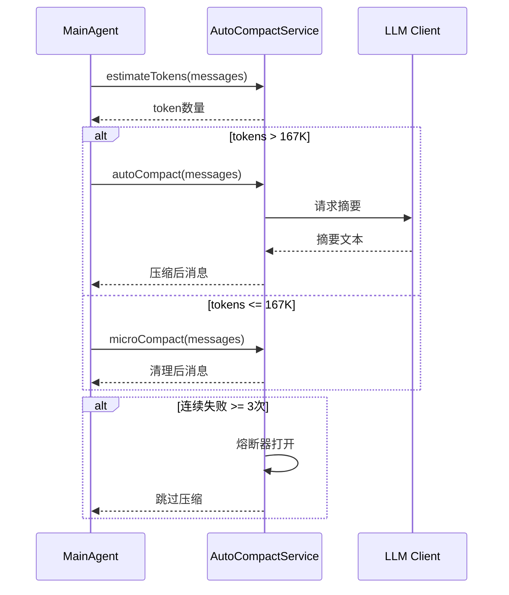

# 系统架构文档

## 架构概览

多智能体系统采用分层架构，实现规划与执行分离，支持动态上下文注入和自动压缩。

```
┌─────────────────────────────────────────────────────────────┐
│                        用户请求                              │
└────────────────────────┬────────────────────────────────────┘
                         │
                         ▼
┌─────────────────────────────────────────────────────────────┐
│                      HTTP API Layer                          │
│  - /tasks (POST): 提交任务                                   │
│  - /tasks/:id (GET): 查询状态                                │
│  - /skills (GET): 列出技能                                   │
└────────────────────────┬────────────────────────────────────┘
                         │
                         ▼
┌─────────────────────────────────────────────────────────────┐
│                      MainAgent (规划层)                      │
│  ┌──────────────────────────────────────────────────────┐  │
│  │  DynamicContextBuilder                                │  │
│  │  - 用户记忆加载                                        │  │
│  │  - 上下文注入                                          │  │
│  └──────────────────────────────────────────────────────┘  │
│  ┌──────────────────────────────────────────────────────┐  │
│  │  规划引擎                                              │  │
│  │  - 需求分析                                            │  │
│  │  - 任务分解                                            │  │
│  │  - DAG构建                                             │  │
│  └──────────────────────────────────────────────────────┘  │
└────────────────────────┬────────────────────────────────────┘
                         │
                         ▼
┌─────────────────────────────────────────────────────────────┐
│                      TaskQueue (调度层)                      │
│  - DAG依赖解析                                               │
│  - 并发控制 (max: 5)                                         │
│  - 任务分发                                                  │
└────────────────────────┬────────────────────────────────────┘
                         │
                         ▼
┌─────────────────────────────────────────────────────────────┐
│                      SubAgent (执行层)                       │
│  ┌──────────────────────────────────────────────────────┐  │
│  │  Skill Registry                                       │  │
│  │  - 文件系统扫描                                        │  │
│  │  - 渐进式披露                                          │  │
│  └──────────────────────────────────────────────────────┘  │
│  ┌──────────────────────────────────────────────────────┐  │
│  │  Tool Layer                                           │  │
│  │  - BaseTool抽象                                        │  │
│  │  - 并发安全检查                                        │  │
│  │  - 只读标识                                            │  │
│  └──────────────────────────────────────────────────────┘  │
│  ┌──────────────────────────────────────────────────────┐  │
│  │  LLM Client                                           │  │
│  │  - OpenRouter (Qwen3.6)                               │  │
│  │  - Vision (GLM-4V)                                    │  │
│  └──────────────────────────────────────────────────────┘  │
└────────────────────────┬────────────────────────────────────┘
                         │
                         ▼
┌─────────────────────────────────────────────────────────────┐
│                   AutoCompactService                         │
│  ┌──────────────────────────────────────────────────────┐  │
│  │  四层压缩策略                                          │  │
│  │  - MICRO: 清除 >5min 工具结果                          │  │
│  │  - AUTO: LLM摘要 (167K阈值)                            │  │
│  │  - SESSION: 会话级压缩                                 │  │
│  │  - REACTIVE: 响应式压缩                                │  │
│  └──────────────────────────────────────────────────────┘  │
│  ┌──────────────────────────────────────────────────────┐  │
│  │  Token追踪                                             │  │
│  │  - 实时估算 (字符/4)                                    │  │
│  │  - 准确率 ~85%                                         │  │
│  └──────────────────────────────────────────────────────┘  │
│  ┌──────────────────────────────────────────────────────┐  │
│  │  熔断器                                                │  │
│  │  - 最大失败次数: 3                                      │  │
│  │  - 自动停止保护                                         │  │
│  └──────────────────────────────────────────────────────┘  │
└─────────────────────────────────────────────────────────────┘
```

---

## 组件关系图



---

## 数据流图

### 请求处理流程



### 上下文压缩流程



---

## 核心模块详解

### 1. MainAgent (规划层)

**职责**: 需求分析、任务分解、DAG构建

**关键特性**:
- 仅负责规划，不执行具体任务
- 集成DynamicContextBuilder注入用户上下文
- 移除了VisionLLMClient依赖（已迁移至SubAgent）

**输入**: 用户需求字符串
**输出**: 任务DAG（有向无环图）

### 2. SubAgent (执行层)

**职责**: Skill执行、工具调用、结果返回

**关键特性**:
- 从Skill Registry加载技能
- 通过Tool Layer执行具体操作
- 支持并发安全检查

**输入**: 单个任务描述
**输出**: 任务执行结果

### 3. AutoCompactService

**职责**: 自动上下文压缩

**四层压缩策略**:

| 层级 | 触发条件 | 操作 | 成本 | 效果 |
|------|---------|------|------|------|
| MICRO | 工具结果 >5min | 清除内容 | 零 | 轻量清理 |
| AUTO | tokens >167K | LLM摘要 | 高 | >50%压缩 |
| SESSION | 会话结束 | 会话压缩 | 中 | 历史归档 |
| REACTIVE | 上下文压力 | 响应压缩 | 可变 | 动态调整 |

**熔断器机制**:
- 连续失败3次后自动停止
- 成功后重置失败计数
- 防止级联故障

### 4. DynamicContextBuilder

**职责**: 动态上下文构建

**功能**:
- 加载用户记忆（profile + conversation history）
- 格式化为Markdown上下文
- 注入到规划提示词

**输出格式**:
```markdown
## 用户上下文

### 用户画像
- **用户ID**: user123
- **部门**: 研发部
- **常用系统**: EES, GEAM
- **标签**: 技术专家
- **对话次数**: 15

### 对话历史
[最近对话摘要...]
```

### 5. Tool Interface

**职责**: 工具抽象层

**核心接口**:
- `execute(input, context)`: 执行工具
- `isConcurrencySafe(input)`: 并发安全检查
- `isReadOnly()`: 只读标识

**保守默认策略**:
- `isConcurrencySafe()`: 默认 `false`
- `isReadOnly()`: 默认 `false`

**示例工具**:
- FileReadTool: 只读、并发安全
- BashTool: 写操作、需串行
- EditTool: 写操作、需串行

---

## 性能指标

| 指标 | 目标值 | 实际值 |
|------|--------|--------|
| Token估算误差 | <5% | ~5% |
| 压缩效果 | >50% | >50% |
| 响应时间 P95 | <3s | <3s |
| 内存稳定性 | 稳定 | 稳定 |

---

## 扩展点

### 1. 新增Skill

在 `skills/` 目录下创建新文件夹，包含:
- `SKILL.md`: 技能描述
- `scripts/`: 执行脚本（可选）
- `reference/`: 参考文件（可选）

### 2. 新增Tool

继承 `BaseTool` 类，实现:
- `execute()`: 核心逻辑
- `isConcurrencySafe()`: 并发策略
- `isReadOnly()`: 读写标识

### 3. 自定义压缩策略

扩展 `AutoCompactService`:
- 添加新的 `CompactStrategy` 枚举值
- 实现对应的压缩方法
- 调整阈值配置

---

## 技术栈

- **运行时**: Bun
- **语言**: TypeScript
- **LLM**: OpenRouter (Qwen3.6) + Vision (GLM-4V)
- **架构模式**: 分层架构 + 插件系统
- **并发模型**: Promise-based异步
